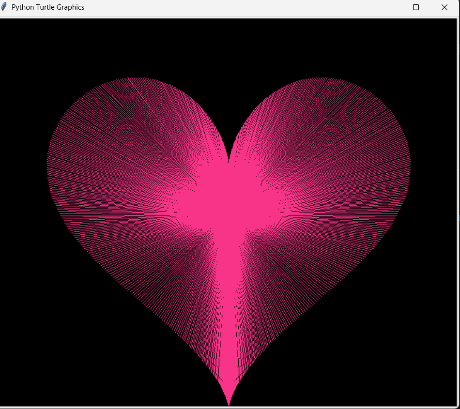

# heart
Creating a heart shape with Python

# Heart Drawing with Python Turtle

This project draws a heart shape using Python's Turtle graphics and mathematical equations.

## Preview



## Description

The program generates a heart shape using parametric equations and plots it using the Turtle module. It creates a visually appealing design with a pink color on a black background.

## How It Works

The heart is created using these formulas:

- x = 15 * sin(t)^3
- y = 12*cos(t) - 5*cos(2t) - 2*cos(3t) - cos(4t)

The program loops through many values and draws lines from the center to form the heart.

## Requirements

- Python 3
- Turtle module (comes with Python)

## How to Run

1. Download or clone the project
2. Open the folder
3. Run the file:

```bash
python main.py


